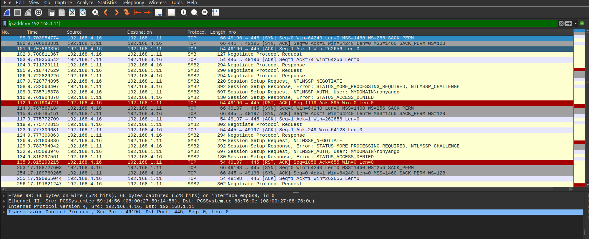

# Network Telemetry — NTLM Authentication (Wireshark)

## Overview

Packet capture analysis using Wireshark revealed NTLM authentication activity between the victim system and the attacker-controlled host.

This activity occurred after the attacker responded to an LLMNR request, causing the victim machine to initiate SMB authentication to the rogue responder. 

The NTLM authentication sequence is visible within the SMB session setup process. 

##  SMB Handshake 

1. The victim host initiated SMB authentication. (Packet No. 107)
2. The attacker responded with an NTLM challenge. (Packet No. 108)
3. The victim sent an NTLM authentication response. (Packet No. 109)

This authentication sequence occurs when the victim system attempts to authenticate to the attacker-controlled machine.

