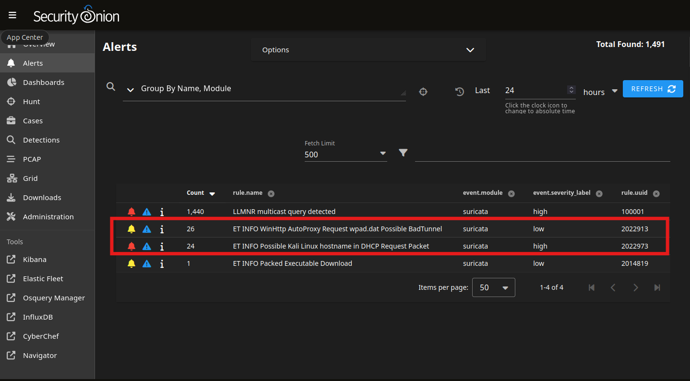

# Security Onion Investigations - IPv6 MiTM

This investigation analyzes alerts generated in Security Onion during the IPv6 Man-in-the-Middle attack using mitm6 and ntlmrelayx. The goal is to identify key indicators of compromise, validate attack activity, and understand how the attack manifests in network telemetry.

--- 

## High Severity Alert: Suspicious DHCP Hostname (Kali Linux)

### Alert:
**"Possible Kali Linux hostname in DHCP request packet" (HIGH)**

### Description:
This rule triggers when the string **"kali"** is detected in the DHCP hostname option field.

### Technical Context:
- **Protocol:** DHCP (Application Layer / Layer 7)
- **Transport:** UDP  
- **Ports:**
  - Client → Server: UDP **68 → 67**
  - Server → Client: UDP **67 → 68**

### Why UDP?
- DHCP is **connectionless and broadcast-based**
- The client does not yet have:
  - An IP address
  - A default gateway
- UDP supports:
  - Broadcast
  - Low overhead communication

---

### Investigation Findings

- **Source IP:** 192.168.4.11 (Attacker – Kali)
- **Source Port:** 68  
- **Destination IP:** 192.168.4.1 (DHCP Server / Gateway)  
- **Destination Port:** 67  

The DHCP request includes a hostname containing **"kali"**, strongly indicating the presence of an attacker-controlled machine on the network.

---

### Analyst Insight

This alert is significant because:
- It reveals **unauthorized device presence**
- It occurs **early in the attack lifecycle (initial access / positioning)**
- It provides a **clear attribution clue** (attacker OS fingerprint)

---

## Low Severity Alert: WPAD Discovery (Proxy Abuse)

### Alert:
**"WinHttp AutoProxy Request wpad.dat Possible BadTunnel" (LOW)**

### Description:
Triggered when a system attempts to retrieve a WPAD configuration file (`wpad.dat`) over HTTP.

---

### Investigation Findings

- The victim initiates:
`HTTP GET /wpad.dat`

- The rogue server responds with:
`fakewpad.mydomain.com`

This confirms:
- WPAD spoofing is in progress
- The attacker is controlling proxy configuration

---

### Analyst Insight

Although marked as **LOW severity**, this alert is critical in context because:

- It directly precedes **NTLM credential theft**
- It indicates **proxy-based traffic interception**
- It is a **key step in the attack chain**

> In real environments, this alert can easily be overlooked due to noise, making it dangerous.

---

## Traffic Pattern Observed

Further analysis of network traffic revealed the following sequence:

1. **HTTP** – WPAD request (`wpad.dat`)
2. **SMB** – Authentication attempts
3. **ICMP** – Network communication
4. **SMB** – Continued authentication / relay activity

---

### Interpretation

This sequence aligns with the attack flow:

- WPAD discovery → proxy configuration  
- Forced authentication → NTLM challenge/response  
- Relay activity → SMB / LDAP interactions  

---

## Suspicious File Analysis

### File:
`IcoPp1YU.exe`

### Summary (VirusTotal):
- **56/72 vendors flagged as malicious**
- Classified as:
- Trojan
- Downloader
- Dropper

### Analyst Decision:

Although flagged as malicious, this artifact was **not directly related to the attack chain under investigation**.

Additional observations:
- Associated IP resolves to a legitimate hosting provider (Network Solutions)
- No direct linkage to:
  - WPAD abuse
  - NTLM relay activity

---

### Conclusion on Artifact

> This appears to be a **false lead or unrelated background noise** within the environment.

In real-world investigations:
- Not all alerts are part of the same attack
- Analysts must **correlate activity before escalating**

---

## Key Takeaways

- **High severity alerts (e.g., DHCP anomalies)** can reveal attacker presence early  
- **Low severity alerts (e.g., WPAD requests)** may represent critical attack stages  
- IPv6-based attacks may not trigger traditional IPv4-focused detections  
- Correlation across protocols (DHCP, HTTP, SMB) is essential  

---