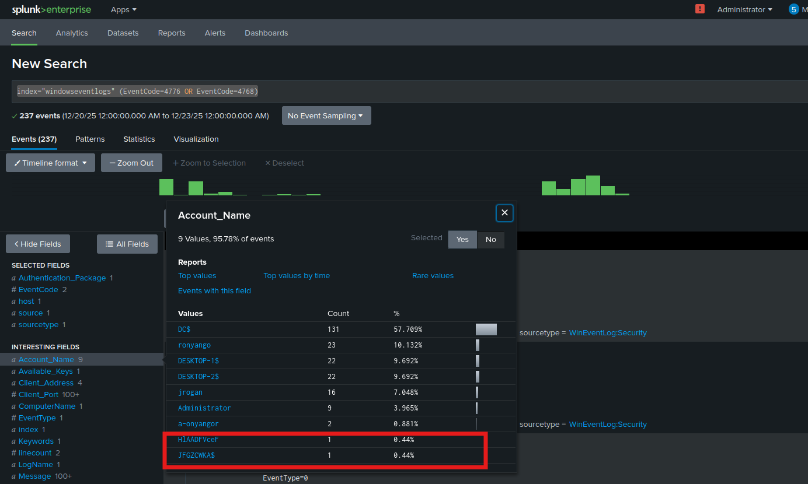
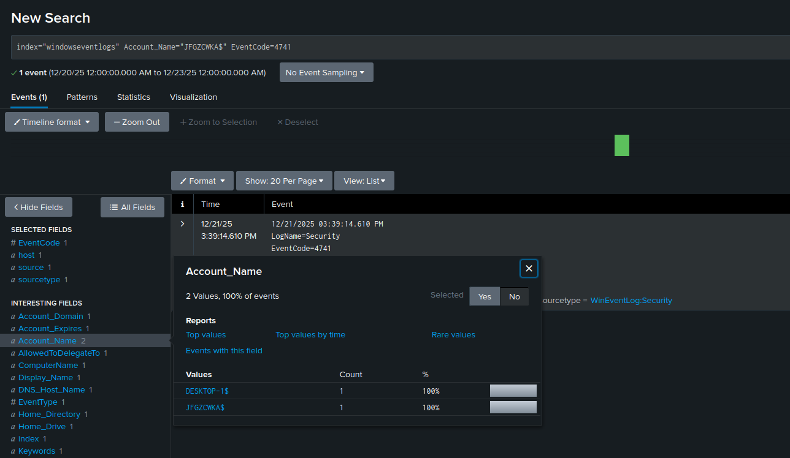
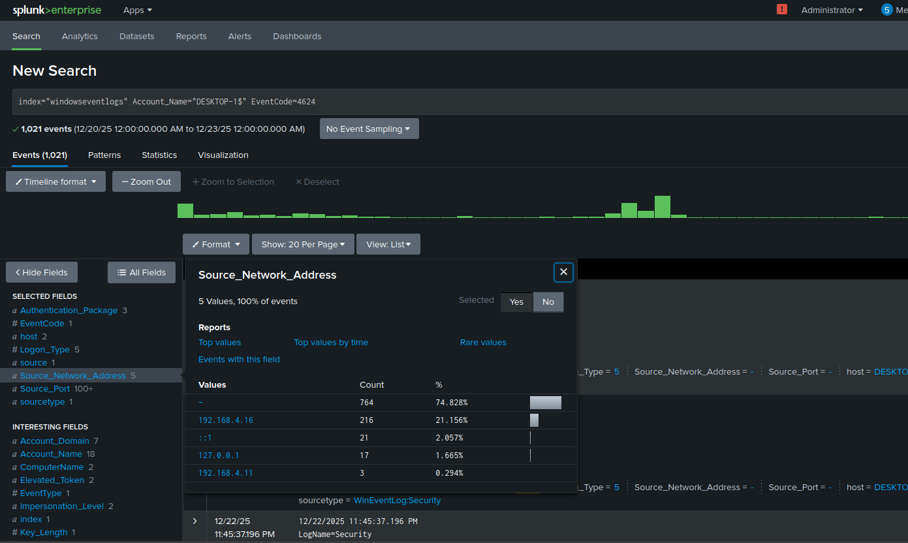
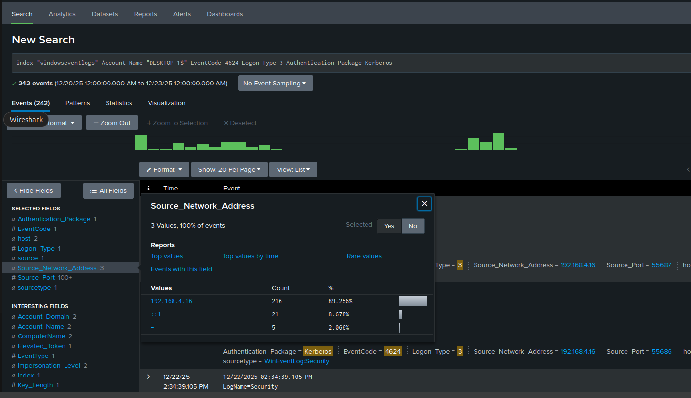
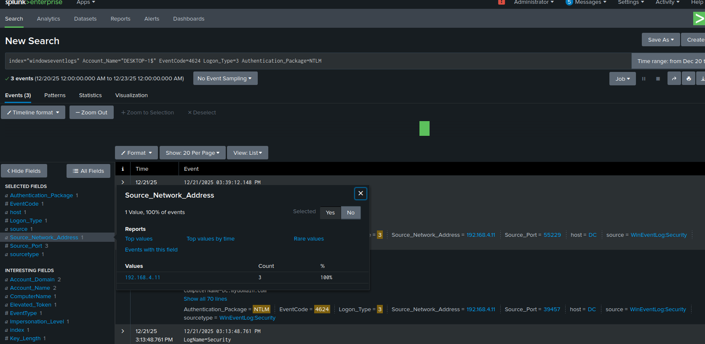
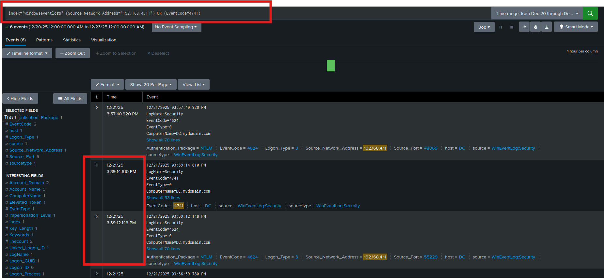
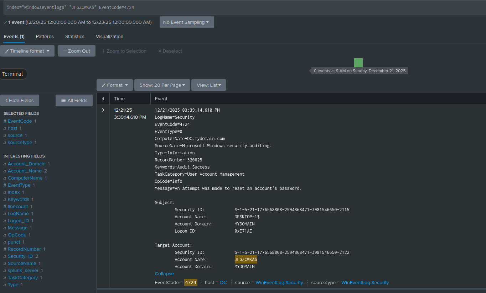
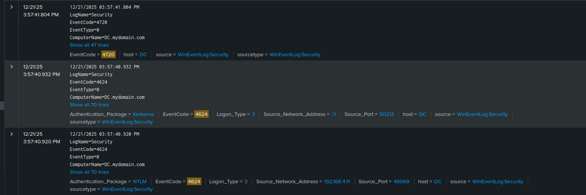

# Splunk Investigation – IPv6 MitM (mitm6 + NTLM Relay)

## Objective

This investigation leverages Splunk to analyze Windows Security Logs and validate suspicious activity identified during the IPv6 Man-in-the-Middle (mitm6 + NTLM relay) attack.

The goal is to:
- Confirm attacker presence
- Identify authentication anomalies
- Trace Active Directory modifications
- Build a timeline of malicious activity

---

## Initial Lead: Suspicious Host on Internal Network

Security Onion identified a HIGH severity alert indicating a possible Kali Linux system on the network:

- **Source IP:** 192.168.4.11  
- **Protocol:** DHCP (UDP 68 → 67)

This establishes a **potential attacker foothold** on the internal subnet.

---

## Step 1: Investigate Authentication Activity

### Key Event IDs:
- **4776** – NTLM authentication validation  
- **4768** – Kerberos Ticket Granting Ticket (TGT) request  

### Findings:
- Multiple authentication attempts observed
- Presence of **unexpected account names** (e.g., `JFGZCWKA$`)
- Account naming does not align with standard enterprise conventions

---

### Analyst Insight

Unrecognized machine account names may indicate:
- Unauthorized domain join
- Attacker-created objects
- Abuse of default Active Directory permissions

---

## Step 2: Confirm Account Creation Activity

### Key Event ID:
- **4741** – Computer account created

### Findings:
- New computer object detected:
  - `JFGZCWKA$`
- Legitimate system identified:
  - `DESKTOP-1$`

---

### Analyst Insight

The creation of a new computer account is suspicious when:
- It follows authentication from an unknown source
- It does not align with provisioning workflows

---

## Step 3: Pivot to Target Host (DESKTOP-1)

### Key Event ID:
- **4624** – Successful logon

### Focus:
- Analyze logons involving:
  - `DESKTOP-1`
  - Suspicious source IP

---

### Findings:

Two IPs successfully authenticated:
- **192.168.4.16** – Known legitimate workstation  
- **192.168.4.11** – Suspicious (previously identified attacker)

---

### Analyst Insight

Multiple source IPs authenticating to the same host may indicate:
- Normal admin activity (benign)
- OR credential abuse / relay attacks (malicious)

Further analysis required.

---

## Step 4: Authentication Method Analysis

### Key Fields:
- `Authentication_Package`
- `Logon_Type`

### Findings:

- **Kerberos authentication**
  - Originates from legitimate host (192.168.4.16)

- **NTLM authentication**
  - Originates from suspicious host (192.168.4.11)

---

### Analyst Insight

- NTLM usage from an unexpected host is suspicious  
- Absence of Kerberos from the same host suggests:
  - NTLM is not fallback behavior  
  - Likely **relay-based authentication**

---

## Step 5: Timeline Correlation

### Query Focus:
- Source IP: `192.168.4.11`
- Event IDs: `4624`, `4741`

### Findings:

- Successful NTLM authentication occurs
- **Within seconds**, a new computer account is created

---

### Analyst Insight

This tight sequence strongly indicates:
- Automated post-authentication action
- Behavior consistent with **ntlmrelayx exploitation**

---

## Step 6: Privileged Activity Detection

### Key Event ID:
- **4724** – Password reset attempt

### Findings:
- Password reset initiated by:
  - `DESKTOP-1$` (workstation account)
- Target:
  - Non-standard domain account

---

### Analyst Insight

This behavior is highly anomalous because:
- Workstation accounts should not perform password resets
- Indicates:
  - Abuse of delegated permissions
  - Possible RBCD / ACL manipulation

---

## Step 7: Additional User Account Creation

### Key Event ID:
- **4720** – User account created

### Findings:
- New user account created shortly after:
  - NTLM authentication from `192.168.4.11`
- Associated with:
  - Privileged account activity

---

### Analyst Insight

This confirms:
- **Privilege escalation**
- Unauthorized use of elevated credentials
- Strong indicator of domain compromise

---

## Attack Timeline Summary

1. Attacker joins network (DHCP – 192.168.4.11)  
2. NTLM authentication to DESKTOP-1  
3. Successful logon (Event 4624)  
4. Computer object created (Event 4741)  
5. Password reset activity (Event 4724)  
6. User account created (Event 4720)  

---

## Hypothesis

An unauthorized host (192.168.4.11) joined the internal network and initiated NTLM-based authentication to a domain workstation (DESKTOP-1).

Following successful authentication:
- A new computer object was created  
- Privileged directory operations were performed  
- A user account was created  

This sequence strongly aligns with **NTLM relay attack behavior**, where intercepted credentials are relayed to Active Directory services to perform actions without direct credential compromise.

Windows Event Logs confirm:
- Authentication abuse  
- Privileged operations  

However, they do not reveal the credential interception mechanism, requiring **network-level correlation** (e.g., WPAD abuse via Security Onion).

---

## Key Takeaways

- NTLM authentication from unexpected sources is a high-risk indicator  
- Rapid sequence of authentication → AD changes is highly suspicious  
- Workstation accounts performing privileged actions indicate compromise  
- Correlation across logs is essential to uncover attack chains  

---

## Conclusion

Splunk analysis confirms that:

- An unauthorized system gained network access  
- NTLM authentication was successfully relayed  
- Active Directory objects were created and modified  
- Privileged operations were executed without legitimate administrative workflow  

This investigation demonstrates how **credential relay attacks manifest in host-based logs**, and highlights the importance of correlating authentication activity with directory changes to detect advanced attacks.

---