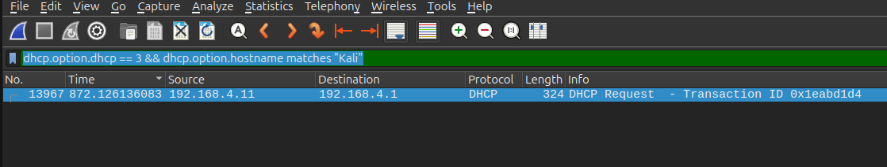
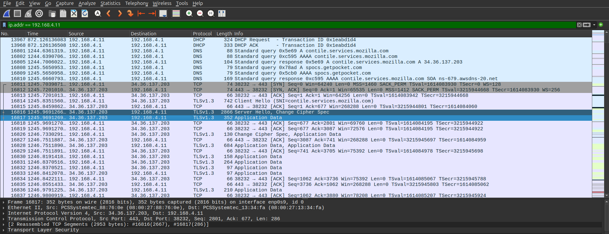
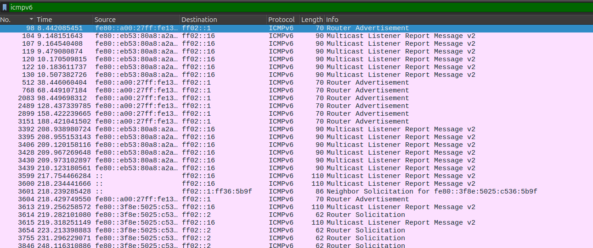
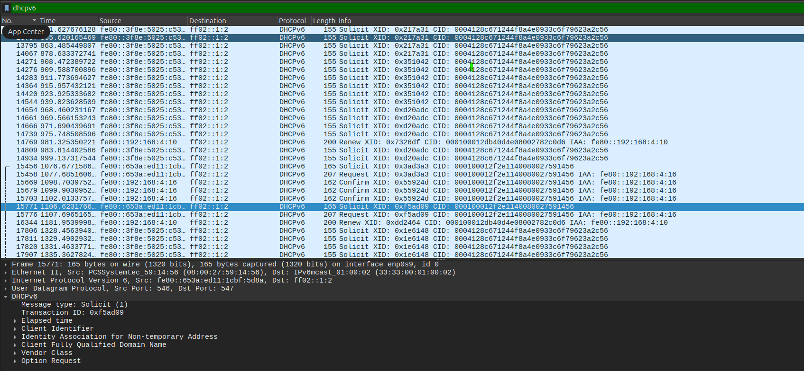
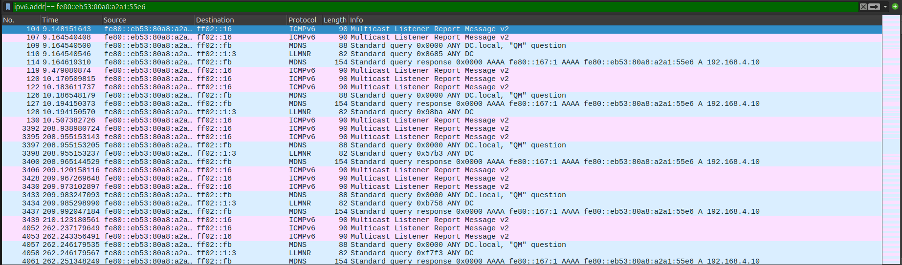
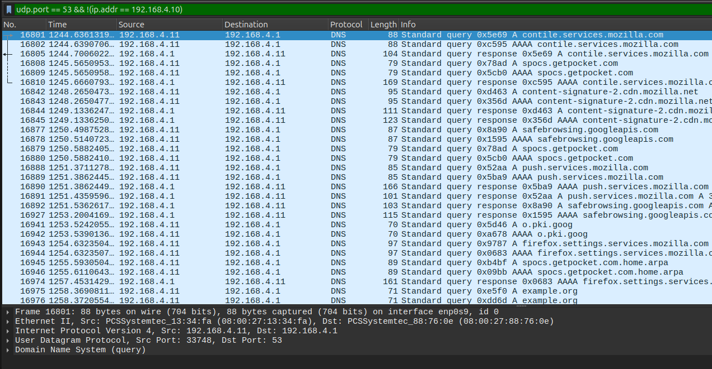
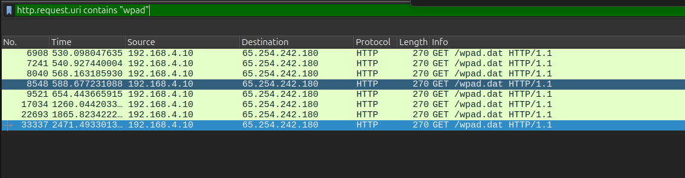

# Wireshark Investigation – IPv6 MitM (mitm6 + NTLM Relay)

## Objective

This investigation uses packet-level analysis in Wireshark to validate and expand upon findings from Security Onion and Splunk during an IPv6 Man-in-the-Middle (mitm6 + NTLM relay) attack.

The goal is to:
- Confirm attacker network positioning
- Identify protocol abuse (IPv6, DNS, WPAD)
- Understand how authentication was coerced
- Correlate network activity with host-based events

---

## Data Source

- PCAP captured during attack simulation
- Capture window:
  - Started before attack execution
  - Stopped after successful NTLM relay and object creation

> In enterprise environments, packet analysis is typically guided by timestamps from SIEM tools such as Splunk.

---

## Initial Observation: Protocol Landscape

Using Wireshark coloring rules, the following protocols were identified:

- ICMP / ICMPv6  
- ARP  
- DHCP / DHCPv6  
- DNS  
- HTTP  
- SMB  
- TCP / UDP  

---

### Analyst Insight

This protocol mix aligns with earlier findings:
- HTTP → WPAD activity  
- SMB → authentication attempts  
- ICMPv6 → IPv6 control-plane activity  

This establishes a strong foundation for correlating network activity with known attack techniques.

---

## Phase 1: Unauthorized Network Access (DHCP)

Packet analysis confirms that a host with IP address `192.168.4.11` requested network configuration via DHCP.

The hostname field in the request contains **"kali"**, indicating that the device is likely an attacker-controlled system.

---

### Analyst Insight

- Confirms attacker presence on the internal network  
- Matches Security Onion HIGH severity alert  
- Establishes the initial access point in the attack chain  

---

## Phase 2: Suspicious DNS Behavior (IPv4)

Following network access, the host `192.168.4.11` is observed performing DNS queries and communicating with an external server (`34.36.137.203`).

---

### Analyst Insight

In a typical Active Directory environment:
- Clients resolve DNS via the Domain Controller (`192.168.4.10`)

The observed behavior indicates:
- The rogue host is actively participating in name resolution  
- It is behaving like a **DNS intermediary**, which is not expected for standard client systems  

---

### Key Question

> How is the rogue host influencing DNS behavior when only IPv4 traffic is visible?

---

### Hypothesis

IPv6 may be introducing:
- An alternate DNS path  
- A hidden routing mechanism not visible in IPv4 traffic  

This becomes the next logical pivot point in the investigation.

---

## Phase 3: Rogue IPv6 Router Advertisements (ICMPv6)

Packet analysis reveals that an IPv6 address is sending Router Advertisement messages to all nodes on the network.

These messages are sent to the multicast address:
- `ff02::1` (all-nodes multicast group)

---

### Analyst Insight

- Confirms the presence of a **rogue IPv6 router**  
- Enables:
  - Automatic client configuration  
  - Traffic redirection  
  - DNS manipulation  

> This is a foundational step in IPv6-based man-in-the-middle attacks.

---

## Phase 4: DHCPv6 Configuration Acceptance

Following the Router Advertisements, internal hosts initiate DHCPv6 communication.

Observed behavior includes:
- Clients requesting configuration from available DHCPv6 servers  
- Subsequent acceptance of configuration parameters  

---

### Analyst Insight

- Confirms that clients accepted IPv6 configuration  
- Indicates the presence of an active DHCPv6 service  
- Suggests that the rogue host successfully introduced new network settings  

---

## Phase 5: DNS Degradation and Multicast Name Resolution

Further analysis shows an increase in multicast traffic, including:

- Multicast Listener Discovery (MLDv2)  
- Link-Local Multicast Name Resolution (LLMNR)  

---

### Analyst Insight

- LLMNR and mDNS are fallback mechanisms used when DNS resolution fails  
- Their presence indicates:
  - Name resolution instability  
  - Reduced trust in standard DNS  

The rogue host is observed responding to these multicast queries, suggesting:
- Active participation in name resolution  
- Potential poisoning or interception of requests  

---

## Phase 6: DNS Manipulation Confirmation

The rogue host (`192.168.4.11`) is observed actively participating in DNS traffic within the network.

Notable behavior includes:
- Repeated A and AAAA queries for the same domains  
- Direct communication with external servers  

---

### Analyst Insight

- This behavior resembles **client-side resolution**, not normal DNS server forwarding  
- Confirms that the rogue host is influencing DNS activity  
- Indicates a shift in network trust toward the attacker-controlled system  

---

## Phase 7: WPAD Discovery and Proxy Abuse

Analysis reveals that systems within the network initiate requests for:

`wpad.dat`

These requests are sent over HTTP and leave the trusted network boundary.

---

### Analyst Insight

- WPAD is triggered when name resolution becomes unreliable  
- Used by systems to discover proxy configuration  

In this context:
- WPAD is abused to redirect traffic  
- It serves as a mechanism to **coerce NTLM authentication**

> WPAD functions as an authentication trigger rather than a payload delivery mechanism.

---

## Correlation with Host-Based Evidence

Although direct NTLM relay traffic is not clearly observable in the packet capture:

- Splunk confirms:
  - NTLM authentication from `192.168.4.11`  
  - Creation of a new computer object  
  - Creation of a new user account  

---

### Analyst Insight

- Network activity created conditions for credential exposure  
- Host-based logs confirm successful exploitation  

This highlights the importance of correlating:
- Network telemetry  
- Endpoint and directory logs  

---

## Attack Chain Summary

1. Rogue host joins network (DHCP)  
2. IPv6 Router Advertisements are introduced  
3. Clients accept IPv6 configuration (DHCPv6)  
4. DNS behavior becomes unstable  
5. Fallback to multicast name resolution (LLMNR/mDNS)  
6. WPAD discovery is triggered  
7. NTLM authentication is coerced  
8. Credentials are relayed (**confirmed in Splunk**)  

---

## Key Takeaways

- IPv6 introduces a **hidden control plane** often overlooked in monitoring  
- Rogue Router Advertisements can silently alter network behavior  
- DNS instability triggers fallback protocols (LLMNR, WPAD)  
- WPAD can be abused to coerce authentication  
- Packet-level analysis is critical for uncovering network-based attacks  

---

## Conclusion

Wireshark analysis confirms that the attacker successfully established a man-in-the-middle position using IPv6-based network manipulation.

The rogue host:

- Introduced itself as a network infrastructure component
- Influenced DNS and name resolution behavior
- Triggered authentication mechanisms (WPAD → NTLM)

While credential relay was not directly visible at the packet level, host-based evidence confirms that the attack resulted in successful authentication and unauthorized Active Directory modifications.

This highlights the importance of:

- Monitoring IPv6 traffic
- Correlating network and host telemetry
- Investigating low-level protocol behavior in modern attack scenarios

---
