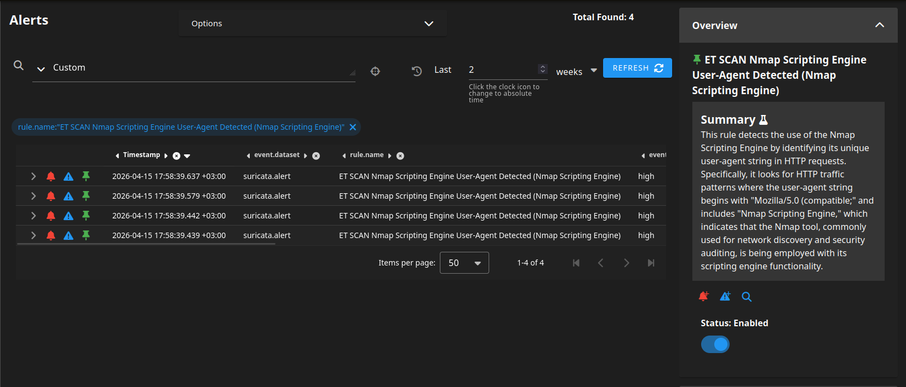

# Security Onion Investigations - Post Compromise Enumeration

This section documents the investigation performed in **Security Onion** after two alerts indicating suspicious **NMAP Activity** was triggered during the Enumeration activity.

--- 

## Alert Overview

The alerts are straight-forward. They point towards network scanning by a host, the source IP field pointing towards the IP 192.168.4.11. 

---

## Source IP Network Activity Investigation

The ports assocaited by the IP **192.168.4.11** are as follows:

| Port No. | Service |
|-----|-----|
| 53 | DNS |
| 443 | HTTPS |
| 67 | DHCP (Listener) |
| 3389 | RDP |
| HTTP | 80 |
| 5985 | WinRM (HTTP) |
| 5986 | WinRNM (HTTPS) |

DNS, HTTPS and DHCP traffic were seen as normal traffic. Attention shifted to RDP and WinRM traffic, escpecially considering that this follows Nmap activity.

Attention was drawn to ports **3389 (RDP) and 5985/5986 (WinRM)**, which are commonly associated with remote access. Analysis of the network data confirmed that these ports were probed as part of Nmap-based enumeration, with no evidence of successful session establishment at this stage.

This raises an important investigative question: ***was remote access actually achieved?*** To answer this, further correlation with host-based logs (e.g., authentication events in Splunk Enterprise) is required, as network scanning alone cannot confirm successful access.