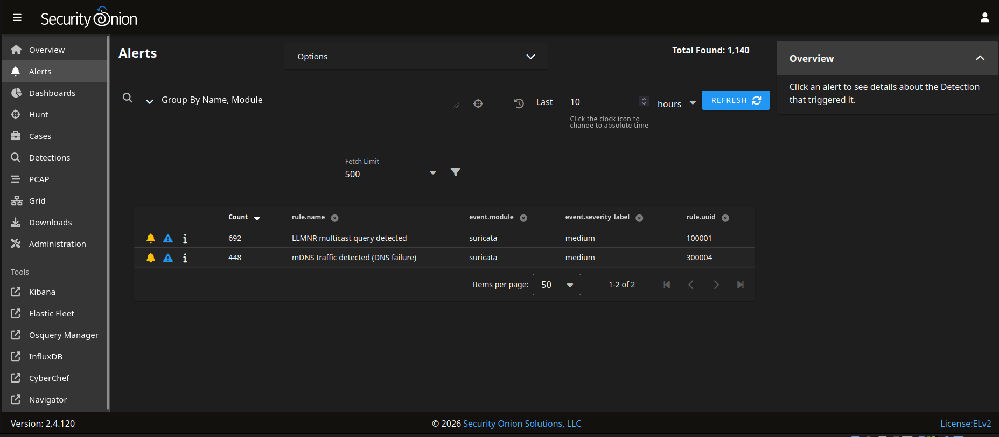
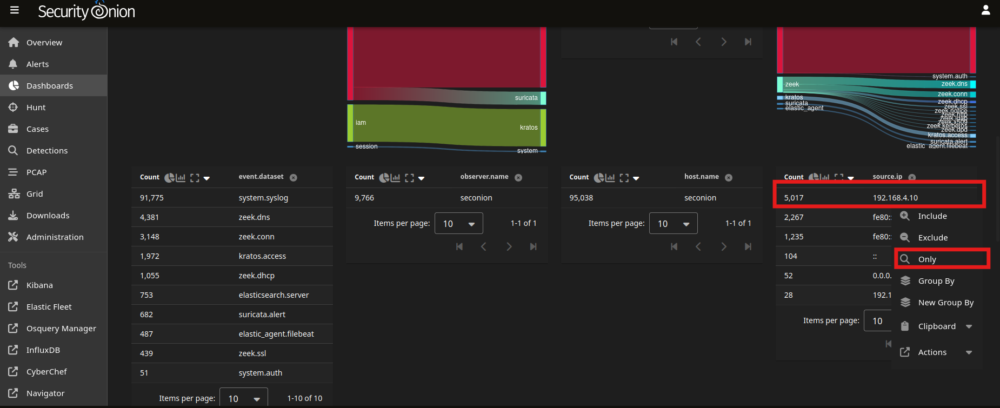
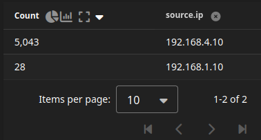
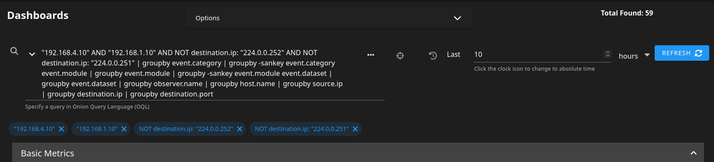

# Security Onion Alerts and Investigations

## Security Onion Alerts

The triggered alerts in the Security Onion IDS console where the LLMNR and mDNSrules that were set up during the LLMNR Poisoining attack. 

Both alerts were triggered multiple times by the Domain Controller `192.168.4.10`.

---

## Security Onion Investigations

Proceed to investigate the network activity on the Domain Controller to confirm whether the alerts need tuning to *reduce the noise and false positives* that may be prevelant due to the lab setup or there may be malicious activity that caused them to trigger. 

### Filter only the DC's network logs

We add parameters as shown in the image above to filter only the the DC's logs. 

We observe an IP address, `192.168.1.10`, not in the local subnet address range `192.168.4.0/24` listed as a Source IP to the DC.

Additionally, we see the events that occured in the Domain Controller are outbound packets to the multicast IP addresses `224.0.0.251` (**mDNS**) and `224.0.0.252` (**LLMNR**). This traffic matches the protocols identified in the triggered alerts and provides context for why the detection rules fired.

### Filter out the multicast IP addresses from the DC's network logs

We focus on any other communication that may have occured on the DC:

We observe the **59** events, all from the Source IP `192.168.1.10` to the Destination IP `192.168.4.10` involving the following well-known **destination ports**:

| Port | Protocol | Summary |
|-----|-----|-----|
| 389 | LDAP | Protocol used for directory queries |
| 88 | Kerberos | Kerberos authentication exchanges to the KDC/AS, KDC/TGT and KDC/TGS |
| 636 | LDAPS | LDAP protected by TLS allowing secure access to Active Directory services |

----

## Conclusion

The investigation shows communication between a malicious host and the Domain Controller over protocols commonly used in Active Directory environments. 