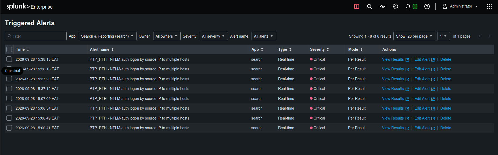
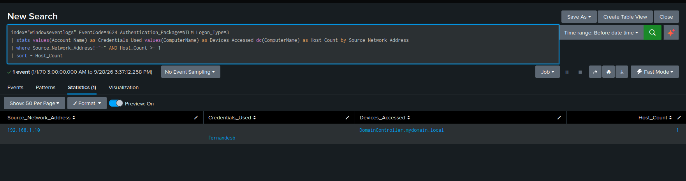
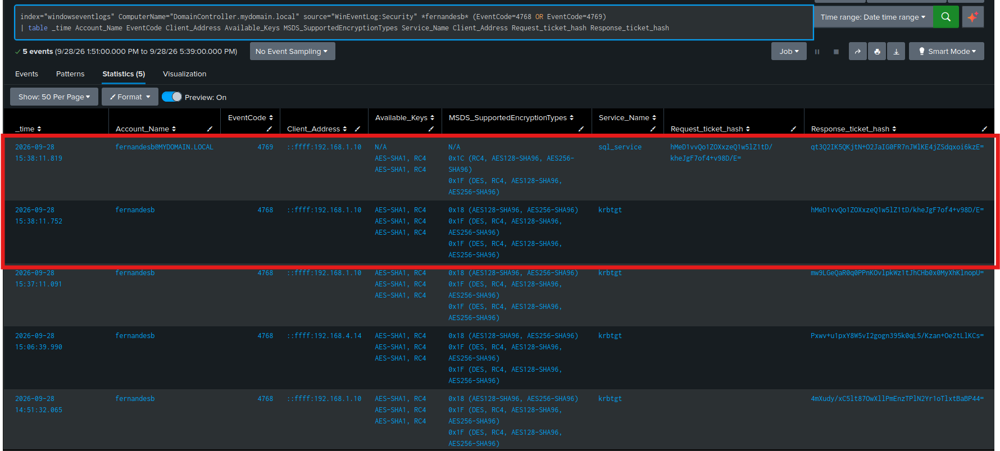
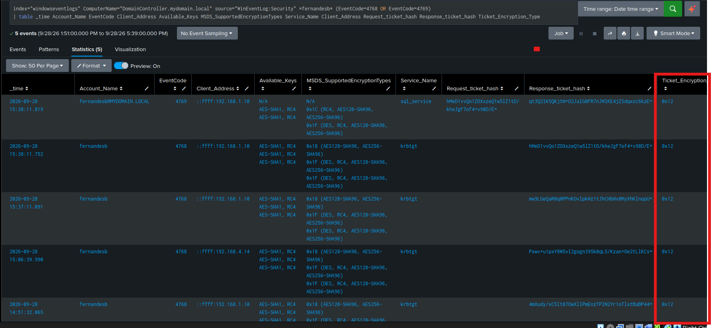

# Splunk Alerts and Investigations

Proceed to investigate endpoint telemetry after gathering the following artifacts from network telemetry investigations:

- Suspicious Source IP: `192.168.1.10`
- Victim Destination IP: `192.168.4.10`
- Protocols Involved: LDAP, Kerberos, LDAPS
- Ports Accesses: 389, 88, 636

## Objective

Leverage Splunk to analyze the Windows Security Event and Sysmon logs to investigate unexpected or malicious activity on the Domain Controller host. 

The goals include:
- Establish whether Kerberos authentication by the suspicious actor was successful on the Domain Controller.
- Determine the domain information that was queried by the suspicious actor.
- Establish whether there were any other malicious activities by this actor.
- Build a timeline of all the malicious activities.

---

## Splunk Alerts

On the Splunk Dashboard, investigate whether any alerts were triggered during the 'attack phase'. Below are the findings in the **Triggered Alert** page on the dashboard:



We observe that the *NTLM-auth logon by source IP to multiple hosts* alert rule, engineered during the **Pass the Hash/ Pass the Password** attack, signatures were matched.

This alert trggers when an IP is used to succcessful logon to hosts in the AD environment using only NTLM authentication.

Investigate the signatures that matched to trigger the alerts by opening it in the search view.



For each of the alerts, the **Source_Network_Address** is **192.168.1.10** the same IP that is invovled in Active Directory communication with the Domain Controller via LDAP, LDAPS and Kerberos. 

We also observe that the credentials used belong to **fernandesb**, a user without Domain Administrator Privileges.

Based on the correlation between the network telemetry and the endpoint telemetry, attribute the host **192.168.1.10** as the malicious actor in this lab. The next step is to review the actor's actions after the successful logon.

## Splunk Investigations

### Step 1: Establish breach window

#### Query Focus  

- **Event ID 4624** - Successful logon
- **Authentication Package: NTLM** - Legacy authentication protocol
- **Suspicious IP** - `192.168.1.10`
- **Credentials Used** - `fernandesb`
- Sort the events by time

#### Query

```spl
index="windowseventlogs" Authentication_Package=NTLM Account_Name=fernandesb
| table _time Source_Network_Address Account_Name ComputerName
| sort - _time
```

#### Findings:

- A *Breach Window* on:
    - Date - **28-09-2026**
    - Timestamps - **14:51:25 - 15:38:11**

### Analyst Insight

- The attacker successfully accessed the Domain Controller multiple times.
- Investigate the activities that occured before, during and after the breach window. 

---

### 2. Filter the security events during the breach window 

Expand the breach window by 1 hour before and 2 hours after the identified breach window. 

#### Query focus

- Splunk's **stats** function to group the events by EventCode and count how often each code appears.
- Investigation  Window: 
    - Start: **13:51:25**
    - End: **17:38:11**

#### Query

```spl
index="windowseventlogs" ComputerName="DomainController.mydomain.local"
| stats count by EventCode
| sort -count
```

#### Findings

- The security events observed on the Domain Controller included: 
    - 4776: The Domain Controller attempted to validate credentials using NTLM.
    - 4672: Special privileges assigned to new logon.
    - 4768: The KDC issued a Kerberos Ticket Granting Ticket (TGT).
    - 4769: A Kerberos service ticket was requested.
    - 4770: A Kerberos service ticket was renewed.
    - 4662: An operation was performed against an Active Directory object.
- The Kerberos events are particularly relevant because they allow the investigation to correlate the successful authentication of `fernandesb` with subsequent Kerberos ticket activity.
---

### 3. Filter the events associated with the malicious IP

Add the malicious IP to the search filter.

#### Query focus

- Add the IP *192.168.1.10* to the filter as a text.

#### Query

```spl
index="windowseventlogs" ComputerName="DomainController.mydomain.local" source="WinEventLog:Security" "192.168.1.10"
```

#### Findings

- Login events, **Event ID 4624** (Successfull logons) and **Event ID 4625** (Failed Logons), were observed with NTLM authentication.
- **Event ID 4768** - A Kerberos TGT was issued
- **Event ID 4769** - A Kerberos service ticket was requested/issued.

---

### 4. Investigate the failed logons

Add the Event ID 4625 to the search query above.

#### Query Focus

- Observe the *Failure Reason* field.

#### Query

```spl
index="windowseventlogs" ComputerName="DomainController.mydomain.local" source="WinEventLog:Security" "192.168.1.10" EventCode=4625
```

#### Findings

- The two events has the same failure reason **Unknown user name or bad password.**
- The events used the **NTLM** authentication package and **Logon_Type = 3 (Network Logon)**

#### Analyst Insight

The failed authentication events provide evidence of unsuccessful authentication attempts from the suspicious host, but their low frequency alone is insufficient to classify the activity as brute force or password spraying.

---

### 5. Investigate successful logons

#### Query Focus
Identify the following field values: 
- Logon IDs.
- Authentication Package.
- Account_Name.

#### Query

```spl
index="windowseventlogs" ComputerName="DomainController.mydomain.local" source="WinEventLog:Security" "192.168.1.10" EventCode=4624
```

#### Findings

- **Account_Name** = `fernandesb`
- **Authentication_Package** = NTLM
- **Logon Type** = Network Logon (remote logon)
- **Logon IDs** = 8 instances

#### Analyst Insight
The successful logon events establish that the credentials associated with fernandesb were successfully used from the suspicious host 192.168.1.10 to authenticate to the Domain Controller using NTLM.

This provides the authentication context for investigating the subsequent Kerberos activity.

---

### 6. Correlate the Kerberos events with the insecure logon sessions

#### Query Focus

- Timeline of the Events created or associated by the user `fernandesb` during the attack Window.

#### Query

```spl
index="windowseventlogs" ComputerName="DomainController.mydomain.local" source="WinEventLog:Security" *fernandesb*
| table _time EventCode Account_Name Authentication_Package Source_Network_Address
| sort - _time
```

#### Findings

The following events occur in close temporal proximity:
- **Event ID 4776** (NTLM credential validation) and **Event ID 4624** (Successful network logon) occur in the same timestamp.
- **Event ID 4768** - TGT TGT issued by the KDC.
- **Event ID 4769** - Service ticket requested for the target service.

---

### 7. Investigate the Kerberos Encryption Types

#### Query Focus
- **Event ID 4768** - TGT issuance.
- **Event ID 4769** - Service ticket request.
- **Service_Name**
- **Ticket Hashes** - Kerberos request/response ticket hashes.
- **MSDS_SupportedEncryptionTypes** - Encryption types supported by the relevant account/service.
- **Available Keys** - Encryption keys available to the relevant account.

#### Query

```spl
index="windowseventlogs" ComputerName="DomainController.mydomain.local" source="WinEventLog:Security" *fernandesb* (EventCode=4768 OR EventCode=4769)
| table _time Account_Name EventCode Client_Address Available_Keys MSDS_SupportedEncryptionTypes Service_Name Client_Address Request_ticket_hash Response_ticket_hash
```

#### Findings

- The available keys shown in the events include **AES-SHA1** and **RC4**.
- The **4768** event shows the successful Kerberos TGT issuance to `fernandesb`.
- The subsequent **4769** event identifies `sql_service` as the requested service.
- The **4769** event contains both the *RequestTicketHash* and *ResponseTicketHash*.
- The close timestamps show the TGT being used to obtain the service ticket:
    - **4768**: 15:38:11.752
    - **4769**: 15:38:11.819
- The service-ticket response was successfully generated and returned to the client.

The final event provides the endpoint-telemetry evidence that connects the Kerberos authentication flow to the `sql_service` service account targeted during the Kerberoasting attack.

Microsoft documents **Event 4768** as the KDC issuing a TGT and **Event 4769** as the request for a service ticket. The newer Windows event fields also expose the account/service encryption capabilities and the ticket encryption type, which should be distinguished from the list of available keys.



---

## Exploit Timeline Summary

1. **14:51:25** — First relevant successful NTLM authentication activity associated with fernandesb from the suspicious host 192.168.1.10.
2. **14:51:25 – 15:38:11** — Multiple successful and unsuccessful authentication events are observed from the suspicious host.
3. **15:37:11.091** — A Kerberos TGT is issued to fernandesb from 192.168.1.10.
4. **15:38:11.752** — A subsequent Kerberos TGT is issued to fernandesb.
5. **15:38:11.819** — A Kerberos service-ticket event is generated for sql_service.
6. The 4769 event contains the **request and response ticket hashes**, providing the final endpoint telemetry evidence of the service-ticket acquisition.

---

## Hypothesis

The evidence supports the hypothesis that the attacker, operating from **192.168.1.10**, used valid credentials associated with **`fernandesb`** to authenticate to the Domain Controller and subsequently interacted with the Kerberos Key Distribution Center.

The authentication sequence progressed from successful NTLM authentication to **Kerberos TGT issuance** and finally to a **service-ticket** request for **`sql_service`**.

The **4769** event and its associated ticket hashes provide the endpoint telemetry evidence corresponding to the service-ticket acquisition observed during the Kerberoasting attack.

The investigation therefore establishes a complete telemetry chain:

**`Suspicious Host → NTLM Authentication → Kerberos TGT → Service Ticket Request → sql_service Ticket`**

---

## Key Takeaways
- Network telemetry identified **192.168.1.10** as the suspicious source communicating with the Domain Controller.
- Splunk endpoint telemetry confirmed successful authentication using the `fernandesb` credentials.
- The successful logons used **NTLM with Logon Type 3** (Network Logon).
- Kerberos **Event ID 4768** confirmed successful TGT issuance.
- Kerberos **Event ID 4769** confirmed a subsequent service-ticket request.
- The requested service was `sql_service`, the account targeted during the Kerberoasting attack.
- The final **4769** event contained the **RequestTicketHash and ResponseTicketHash** associated with the service-ticket exchange.
- The investigation demonstrates the value of **correlating network telemetry with Domain Controller endpoint telemetry**.
- Kerberos encryption information should be interpreted using the actual ticket encryption type rather than assuming that the presence of RC4/AES in Available_Keys means that either algorithm was necessarily used for the issued ticket.

---

## Conclusion

The Splunk investigation successfully correlated the network and endpoint telemetry generated during the Kerberoasting attack.

## Conclusion

The Splunk investigation successfully correlated the network and endpoint telemetry generated during the Kerberoasting attack.

The investigation established that the suspicious host **192.168.1.10** successfully authenticated using the compromised **fernandesb** credentials, obtained a Kerberos TGT, and subsequently requested a service ticket for **sql_service**. The final **Event ID 4769** provided the request and response ticket hashes associated with this service-ticket exchange.

The investigation also demonstrated that Kerberos encryption information must be interpreted using the **actual ticket encryption type** rather than assuming that the presence of RC4 or AES in the available keys means that either algorithm was necessarily used for the issued ticket. In this case, the **Ticket Encryption Type of 0x12 identifies the service ticket as AES256**, consistent with the `$krb5tgs$18$` ticket hash extracted during the attack.



At this point, the endpoint telemetry has established **what happened and which encryption type was used**. The next step is to return to the packet capture and examine the Kerberos exchanges directly in **Wireshark**, where the encryption types can be observed at the protocol level across the AS-REQ/AS-REP and TGS-REQ/TGS-REP exchanges.

---