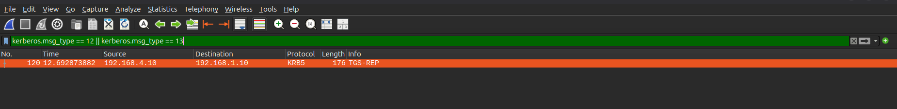
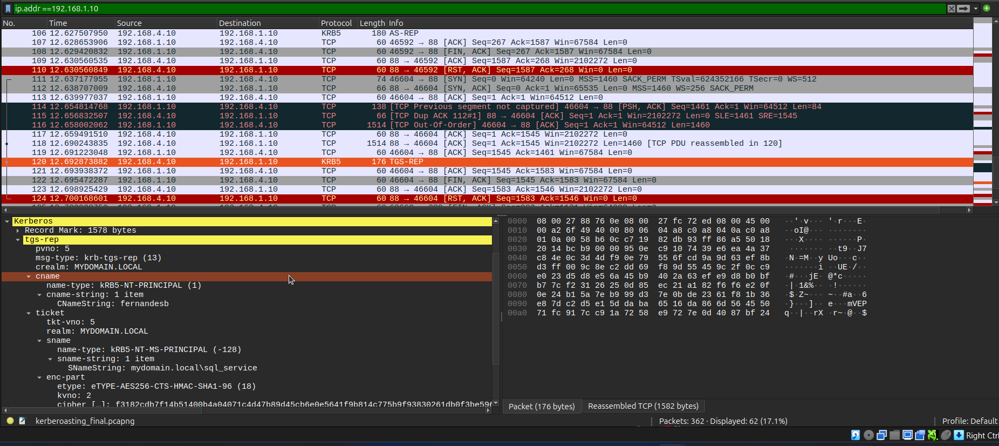

# Wireshark Investigations

## Overview

This phase of the investigation uses packet-level analysis in Wireshark to validate and expand upon findings from Security Onion and Splunk during a Kerberoasting attack.

The goal is to:
- Confirm the Kerberos authentication and ticketing sequence
- Identify the encryption types used during the Kerberos exchanges
- Examine the TGT and service-ticket requests at packet level
- Investigate LDAP and LDAPS activity to identify Active Directory object access
- Correlate packet-level activity with network and endpoint telemetry

---

## Data Source

- PCAP captured during attack simulation
- Capture window:
  - Started before Kerberoasting activity
  - Continued through LDAP authentication and Kerberos ticket exchanges
  - Stopped after the relevant service-ticket response
  
> In enterprise environments, packet analysis is typically guided by timestamps from SIEM tools such as Splunk.

---

## Current Findings

**Security Onion / Suricata**
- Identified `192.168.1.10` communicating with the Domain Controller `192.168.4.10`.
- Observed LDAP, LDAPS and Kerberos traffic.
- Custom LLMNR/mDNS alerts provided the initial investigation leads.

**Splunk**
- Confirmed successful NTLM authentication from `192.168.1.10` using `fernandesb`.
- Correlated NTLM authentication with Kerberos TGT (`4768`) and service-ticket (`4769`) activity.
- Identified `sql_service` as the targeted service.
- Confirmed the service ticket encryption type as `0x12` (AES256).

**Looking for in Wireshark**
- Validate the Kerberos exchanges at packet level and observe the encryption types directly.
- Investigate the LDAP/LDAPS traffic to determine what Active Directory objects were accessed.

---

## Investigate malicious IP packets

Add the malicious IP address, **192.168.1.10** to the  search filter.

```wireshark
ip.addr==192.168.1.10
```

---

## Initial Observation: Protocol Landscape

Using Wireshark's protocol hierarchy rules, the following prtocols are identified:
- LDAP: Port 389 or Port 636
- Kerberos: Port 88

---

## Confirmation of established endpoints and conversations

- Sender: 192.168.1.10
- Receipient: 192.168.4.10

---

## Layer 4 connection (TCP 3-Way Handshake)

Confirmed the completed 3-way TCP handshakle between the malicious client and the domain controller on port 389

- SYN: Client -> Server
- SYN-ACK: Server -> Client
- ACK: Client -> Server

---

## LDAP Communication Flow

After the completed successful connection, we observe a successful authentication by the malicious client *192.168.1.10* on the Domain Controller *192.168.4.10* using NTLM authentication. 

The following is the packet exchange between the two hosts:

- **NTLMSSP_NEGOTIATE**— client tells the Domain Controller which NTLM capabilities/options it supports.
- **NTLMSSP_CHALLENGE** — Domain Controller responds with a challenge.
- **NTLMSSP_AUTH** — client responds to the challenge and provides the authentication information, including the username shown as `mydomain.local\fernandesb`
- **LDAP bindResponse**: success — the Domain Controller accepts the LDAP bind. This packet is evidence that the LDAP authentication succeeded.

---

## Kerberos Investigation

### Kerberos Connection to the KDC

After the successful LDAP authentication, the malicious host `192.168.1.10` established a TCP connection to the Domain Controller `192.168.4.10` on port 88.

- TCP 3-way handshake completed
- Client: `192.168.1.10`
- Server: `192.168.4.10`
- Service: Kerberos
- Port: `88`

The client then initiated a Kerberos **AS-REQ** to the KDC.

### KDC Pre-Authentication Response

The initial AS-REQ was followed by a Kerberos error:

```text
KRB5KDC_ERR_PREAUTH_REQUIRED (25)
```

The response contained:
- PA-ETYPE-INFO
- PA-ETYPE-INFO2
- PA-ENC-TIMESTAMP
- PA-PK-AS-REQ

The **KRB5KDC_ERR_PREAUTH_REQUIRED** response indicates that the KDC required pre-authentication information before processing the authentication request.

This packet does not by itself indicate that authentication ultimately failed. The client subsequently initiated another **AS-REQ**.

### Successful AS Exchange

The subsequent Kerberos exchange contains:
- **AS-REQ** from `192.168.1.10`
- **AS-REP** from `192.168.4.10`

The AS-REP identifies the ticket service as:

```text
krbtgt/MYDOMAIN.LOCAL
```

This confirms that the KDC issued a **Ticket Granting Ticket (TGT)** to the client.

The ticket encryption type is:

```text
AES256-CTS-HMAC-SHA1-96 (18)
```

Therefore:
- Kerberos encryption type: `18`
- Hexadecimal representation: `0x12`
- Encryption: `AES256`

This matches the **Ticket_Encryption_Type = 0x12** observed previously in Splunk.

### TGT and Service Ticket Investigation

The next Kerberos exchange in the capture contains a **TGS-REP**.

Use the following Wireshark display filter to search for Kerberos TGS requests and responses:

```wireshark
kerberos.msg_type == 12 || kerberos.msg_type == 13
```

Where:
- 12 = **TGS-REQ**
- 13 = **TGS-REP**

The capture contains the following relevant result:



The TGS-REP identifies:
- Client: `fernandesb`
- Realm: `MYDOMAIN.LOCAL`
- Service: `mydomain.local\sql_service`
- Ticket encryption type: `AES256-CTS-HMAC-SHA1-96 (18)`

The returned service ticket is therefore associated with the `sql_service` account targeted during the Kerberoasting attack.



## TGS-REQ Not Captured

The Wireshark filter for both Kerberos message types returned the TGS-REP but did not return a corresponding TGS-REQ.

```wireshark
kerberos.msg_type == 12 || kerberos.msg_type == 13
```

Therefore, the PCAP does not provide direct packet-level evidence showing the TGT being presented inside a **TGS-REQ**.

The observed sequence is:

```
AS-REQ
    ↓
KRB5KDC_ERR_PREAUTH_REQUIRED
    ↓
AS-REQ
    ↓
AS-REP
    ↓
TGT issued
    ↓
TGS-REP
    ↓
sql_service service ticket returned
```

The normal Kerberos workflow requires a TGT to obtain a service ticket. Therefore, the observed AS-REP followed by the TGS-REP is consistent with the TGT being used to facilitate the service-ticket request. 

However, because the corresponding TGS-REQ is not present in the captured/displayed traffic, this relationship remains an inference rather than a directly observed packet-level fact.

### Kerberos Encryption Findings

The packet-level investigation identified the following encryption type:

| Kerberos Exchange | Encryption Type | Encryption |
|-----|-----|-----|
| AS-REP TGT | 18 / 0x12 | AES256-CTS-HMAC-SHA1-96 |
| TGS-REP Service Ticket | 18 / 0x12 | AES256-CTS-HMAC-SHA1-96 |

The Wireshark findings therefore correlate with the Splunk investigation, which also identified the service ticket encryption type as **0x12**.

The extracted Kerberos ticket hash previously observed during the attack also used the **$krb5tgs$18$** format, consistent with Kerberos encryption type 18.

### Kerberos Investigations Findings summary

- **192.168.1.10** established a Kerberos connection to the Domain Controller **192.168.4.10**.
- The client initially received **KRB5KDC_ERR_PREAUTH_REQUIRED**.
- A subsequent **AS-REQ** resulted in an **AS-REP**.
- The KDC issued a TGT for the **krbtgt/MYDOMAIN.LOCAL service**.
- The TGT was encrypted using **AES256**, Kerberos etype **18 / 0x12**.
- A subsequent TGS-REP returned a service ticket for **mydomain.local\sql_service**.
- The service ticket was also encrypted using AES256, etype **18**.
- The corresponding TGS-REQ is not present in the captured/displayed packets, so direct observation of the TGT being presented cannot be established from this PCAP.

## Conclusion

