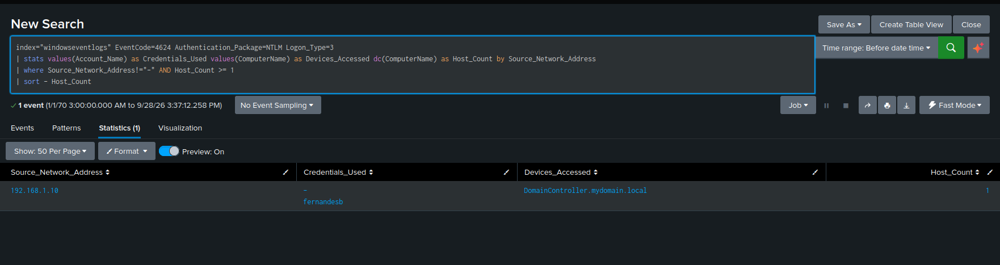
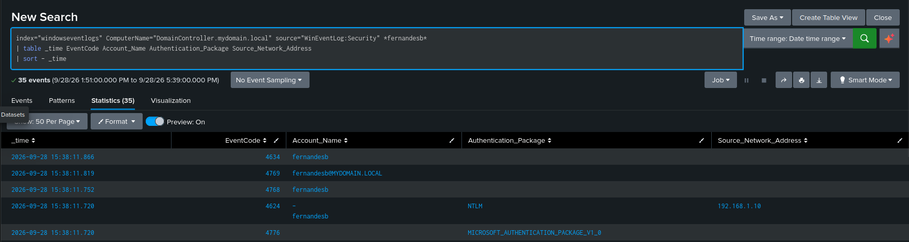

# Endpoint Telemetry - Splunk (Windows Security and Sysmon Logs)

## Overview

Splunk provides visibility into host-based activity through Windows Security Logs, enabling detection of authentication events and Active Directory modifications.

In this lab, Splunk was used to:
- Confirm authentication activity by NTLM and Kerberos
- Identify LDAP and LDAPS activity associated with the malicious host
- Investigate Active Directory access
- Investigate unauthorized access to Domain objects
- Correlate authentication and Kerberos events into an attack timeline

---

## Key Observations

### 1. Alert triggered: NTLM authentication by malicious Source IP

- Source IP: `192.168.1.10`
- Target: `DomainController.mydomain.local`
- Event ID: **4624 (Successful Logon)**
- Authentication Package: **NTLM**
- Logon Type: **3 (Network)**
- Credentials used: `fernandesb`

#### Insight: 
- NTLM-auth successful logon from host with IP address outside the local AD address space `192.168.4.0/24`
- The `fernandesb` credentials were used in this logon.
- The successful authentication establishes the initial endpoint telemetry associated with the malicious host.

---

### 2. Malicious actor flow of events

- Event ID: 4776
- Event ID: 4624, NTLM-auth, Network Logon
- Event ID: 4768
- Event ID: 4769
- Event ID: 4634

#### Insights:
- After successful authentication using the `fernandesb` credentials, the malicious actor proceeded to obtain a Kerberos TGT through Event ID `4768`.
- The TGT was subsequently used to request a Kerberos service ticket through Event ID `4769`.
- The Kerberos TGT and service-ticket events occurred within milliseconds of each other.
- The sequence demonstrates automated progression through the Kerberos authentication and service-ticket request process.
- Event ID `4634` indicates the logoff associated with the session.

### 3. TGT obtained during malicious session used to obtain service-ticket

- Event ID: 4768
- Event ID: 4769
- Service Name: `sql_service`
- Available keys: AES-SHA1, RC4
- Ticket Encryption Type: `0x12`
- Request_ticket_hash: `hMeD1vvQo1ZOXxzeQ1w5lZ1tD/kheJgF7of4+v98D/E=`
- Response_ticket_hash: `qt3Q2IK5QKjtN+O2JaIG0FR7nJWlKE4jZSdqxoi6kzE=`

#### Insights:
- Event ID `4768` confirms the successful acquisition of a Kerberos TGT.
- Event ID `4769` identifies `sql_service` as the service for which the ticket was requested.
- The service-ticket event contains both the request and response ticket hashes.
- The `Ticket_Encryption_Type` is `0x12`, identifying the service ticket as **Kerberos encryption type 18 (AES256)**.
- The service-ticket encryption type is therefore determined from the actual ticket encryption field rather than inferred from the available keys.
- The response ticket hash provides the ticket material subsequently extracted for the Kerberoasting attack.
- The Splunk evidence therefore correlates the malicious authentication session with the acquisition of the `sql_service` Kerberos service ticket.

---

## Attack Timeline

The Splunk investigation established the following sequence:

1. **192.168.1.10** initiates authentication activity against the Domain Controller.
2. The `fernandesb` credentials are successfully used through **NTLM Network Logon** (`4624`).
3. The Domain Controller performs NTLM credential validation (`4776`).
4. A Kerberos **TGT** is issued (`4768`).
5. The obtained TGT is used to request a service ticket (`4769`).
6. The requested service is identified as **`sql_service`**.
7. The service-ticket event contains the request and response ticket hashes.
8. The service ticket is identified as **encryption type `0x12` (AES256)**.
9. The session subsequently generates a logoff event (`4634`).

## Detection and Investigation Value

The Splunk investigation demonstrates how Windows Security Event Logs can be used to correlate individual authentication events into an attack sequence.

The most significant telemetry was the relationship between:

**NTLM Authentication → TGT Issuance → Service Ticket Request → `sql_service`**

The investigation also demonstrates the importance of examining the actual Kerberos ticket encryption type. Although the available keys included **AES-SHA1 and RC4**, the issued service ticket was identified as **`0x12` (AES256)**.

This distinction is important when investigating Kerberos attacks because the encryption capabilities available to an account do not necessarily indicate the encryption type used by an individual ticket.

---

## Limitations

Splunk endpoint telemetry provided strong evidence of the authentication and Kerberos ticketing activity, but the logs alone do not provide the complete packet-level view of the Kerberos exchange.

The Splunk investigation established that the service ticket was issued and identified its encryption type, but packet capture analysis is required to examine the Kerberos protocol exchanges directly.

The next stage of the investigation is therefore to return to the captured traffic in **Wireshark** and correlate the endpoint events with the underlying Kerberos **AS-REQ/AS-REP** and **TGS-REQ/TGS-REP** exchanges.

---

## Conclusion

Splunk successfully established the endpoint-side evidence of the Kerberoasting attack.

The investigation correlated the suspicious host `192.168.1.10`, the `fernandesb` credentials, NTLM authentication, Kerberos TGT acquisition, and the subsequent request for a service ticket associated with `sql_service`.

The final `4769` event provided the service-ticket hashes and identified the actual ticket encryption type as **`0x12` (AES256)**.

With the endpoint telemetry established, the investigation can now move to the network packet level. **Wireshark will be used to examine the Kerberos exchanges directly and observe the encryption types in the actual protocol traffic.**

---