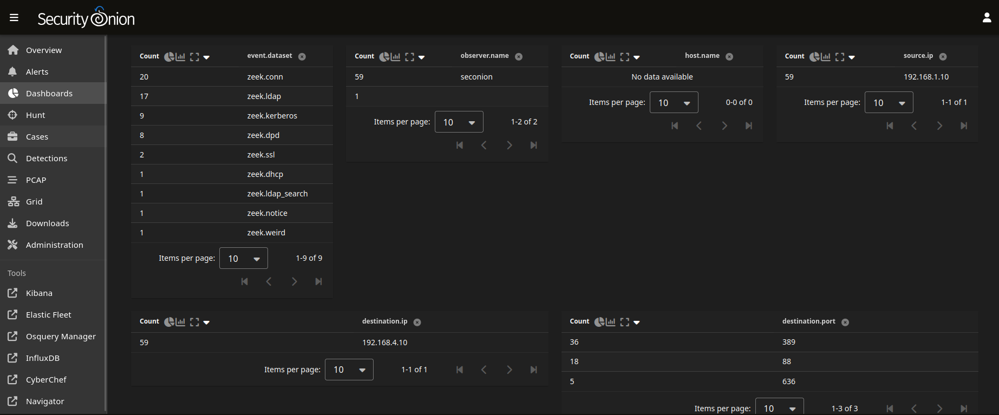

# Network Telemetry – Suricata

## Overview

Suricata IDS, integrated through Security Onion, analyzes network traffic and generates alerts based on configured signatures, protocol behavior, and suspicious activity.

In this lab, Suricata was used to identify and investigate network activity including:
- LLMNR and mDNS traffic matching configured detection rules.
- Communication with the Domain Controller (192.168.4.10) from an IP address outside its local subnet.

---

## Key Observations

### 1. Unexpected IP address communicating with Domain Controller

- Source IP: `192.168.1.10`
- Destination IP: `192.168.4.10`
- Protocols: LDAP, Kerberos, LDAPS
- Ports: 398, 88, 636

#### Observed behaviour
- Network events show communication between suspicious host `192.168.1.10` and the Domain Controller `192.168.4.10` across different subnets.
- The traffic included commonly used Active Directory access and authentication protocols.
- Multicast traffic from the DC to 224.0.0.251 (mDNS) and 224.0.0.252 (LLMNR), matching the protocols associated with the triggered IDS alerts.

#### Insight
- An attacker operating from a different subnet can communicate with the Active Directory services when network routing and access allow it. Being on the same subnet as the Domain Controller is not inherently requried fpr LDAP or Kerberos ticket requests.
- The presence of LDAP, Kerberos, and LDAPS traffic is consistent with Active Directory operations, but network events alone do not establish that authentication succeeded, that a service ticket was issued, or that an account was compromised.

---

## Detection Value

Suricata network telemetry provides:
- **Signature-based alerting**: Detects traffic matching configured rules, including LLMNR and mDNS activity that may warrant investigation.
- **Network-level visibility**: Identifies source and destination IP addresses, ports, protocols, and communication patterns involving critical infrastructure such as Domain Controllers.
- **Remote-source visibility**: Helps identify communication with Active Directory services from IP addresses outside the expected local subnet, providing useful context for threat hunting.

---

## Limitations

- **Limited application-level visibility**: Network metadata can identify communication patterns and protocols, but may not reveal the full content or intent of LDAP, Kerberos, or LDAPS transactions.
- **Encrypted traffic**: TLS-protected LDAPS traffic limits visibility into directory queries and responses unless appropriate decryption or endpoint telemetry is available.
- **No direct proof of compromise**: Observing a connection or a Kerberos request does not, by itself, confirm successful authentication, ticket issuance, password recovery, or unauthorized access.
- **Potential false positives**: LLMNR and mDNS are also used by legitimate systems. Alerts based on these protocols require investigation and tuning to distinguish expected activity from suspicious behavior.
- **Limited endpoint context**: Network telemetry alone may not identify the originating process, the logged-on user, or the actions performed on the source host. Correlation with Windows Security events and endpoint telemetry is needed for a fuller investigation.

---

## Conclusion

For a more complete assessment, the network observations should be correlated with the Domain Controller's security events and relevant endpoint telemetry. This will help confirm authentication and account-level outcomes.

---