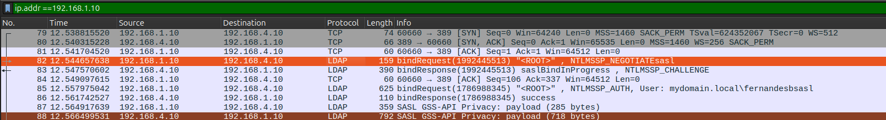
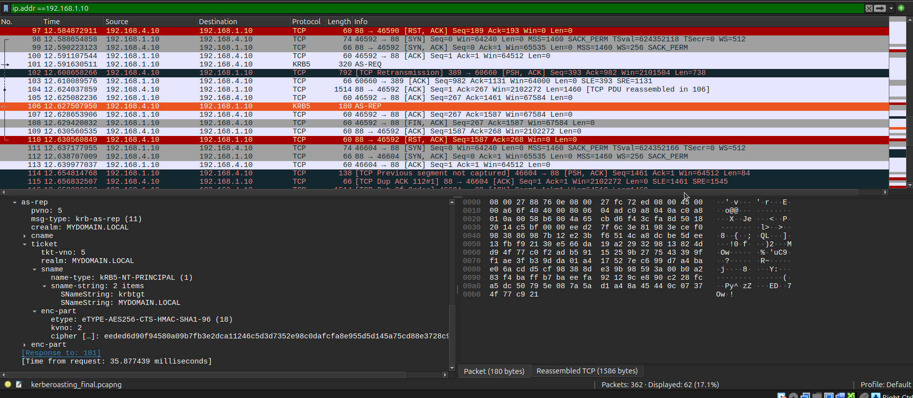

# Packet Telemetry - Wireshark Investigations

## Overview

Wireshark provides packet-level visibility into network communications, allowing investigation of protocol exchanges and validation of findings from Security Onion and Splunk.

In this lab, Wireshark was used to:
- Validate communication between the malicious host and Domain Controller
- Examine LDAP authentication using NTLMSSP
- Analyze Kerberos AS-REQ and AS-REP exchanges
- Identify the encryption types used by Kerberos tickets
- Examine the service-ticket response for `sql_service`
- Correlate packet-level evidence with Security Onion and Splunk findings

---

## Key Observations

### 1. Malicious Host Communication

- Source IP: `192.168.1.10`
- Domain Controller: `192.168.4.10`
- Observed protocols: LDAP, LDAPS and Kerberos
- Kerberos: TCP port `88`
- LDAP: TCP port `389`

#### Insight:

The PCAP confirms direct communication between the suspicious host and the Domain Controller across the identified AD services.

---

### 2. LDAP Authentication



The TCP connection to LDAP port `389` was followed by an LDAP SASL authentication exchange using NTLMSSP.

Observed sequence:

- `NTLMSSP_NEGOTIATE`
- `NTLMSSP_CHALLENGE`
- `NTLMSSP_AUTH`
- LDAP `bindResponse: success`

The `NTLMSSP_AUTH` packet identifies the account as:

`mydomain.local\fernandesb`

#### Insight:

The packet capture provides direct evidence that the suspicious host successfully authenticated to the Domain Controller through LDAP using the `fernandesb` credentials.

---

### 3. Kerberos TGT Acquisition



The malicious host established a Kerberos connection to the Domain Controller on port `88`.

The initial AS-REQ resulted in:

`KRB5KDC_ERR_PREAUTH_REQUIRED`

A subsequent AS-REQ resulted in an AS-REP containing a TGT for:

`krbtgt/MYDOMAIN.LOCAL`

The TGT encryption type was:

`AES256-CTS-HMAC-SHA1-96 (18)`

Equivalent hexadecimal value:

`0x12`

#### Insight:

The PCAP confirms successful Kerberos authentication and TGT issuance using AES256.

---

### 4. Kerberos Service Ticket


A subsequent Kerberos TGS-REP returned a service ticket for:

`mydomain.local\sql_service`

The service ticket encryption type was also:

`AES256-CTS-HMAC-SHA1-96 (18)`

#### Insight:

The packet capture confirms that the `sql_service` account was the target of the service-ticket request and that the returned ticket used AES256.

---

### 5. TGS-REQ Visibility

A Wireshark filter for both Kerberos message types was used:

```wireshark
kerberos.msg_type == 12 || kerberos.msg_type == 13
```

The capture displayed the TGS-REP but did not contain the corresponding TGS-REQ.

#### Insight:

The PCAP directly shows the `TGS-REP` and returned `sql_service` ticket, but does not provide direct packet-level evidence of the TGT being presented in the `TGS-REQ`.

The observed sequence is consistent with the normal Kerberos workflow:

```
AS-REQ → AS-REP/TGT → TGS-REQ → TGS-REP/Service Ticket
```

However, the TGT-to-TGS relationship remains an inference because the TGS-REQ was not captured.

---

## Correlated Findings

The Wireshark investigation validates findings from the other telemetry sources:

- **Security Onion / Suricata**: Identified communication between `192.168.1.10` and `192.168.4.10` over LDAP, LDAPS and Kerberos.
- **Splunk**: Confirmed NTLM authentication using `fernandesb`, TGT issuance, and a service-ticket event targeting `sql_service`.
- **Wireshark**: Provided packet-level evidence of the LDAP NTLMSSP authentication and Kerberos ticket exchanges.
- **Encryption**: Splunk and Wireshark both identified the relevant Kerberos tickets as **AES256**, **etype 18 / 0x12**.

---

## Investigation Value

Wireshark provided visibility into the underlying protocol exchanges that could not be fully reconstructed from Security Onion and Splunk alone.

The investigation demonstrated the value of correlating:

```
Network Telemetry → Endpoint Telemetry → Packet-Level Telemetry
```

This allowed the Kerberoasting activity to be investigated from the network, host and protocol perspectives.

---

## Limitations
The PCAP did not contain the corresponding **TGS-REQ** for the observed **TGS-REP**.

Therefore, the capture cannot directly demonstrate the TGT being presented to request the `sql_service` ticket.

Additionally, the LDAP authentication exchange confirms successful authentication but further LDAP packet analysis is required to determine the specific Active Directory objects accessed after authentication.

---